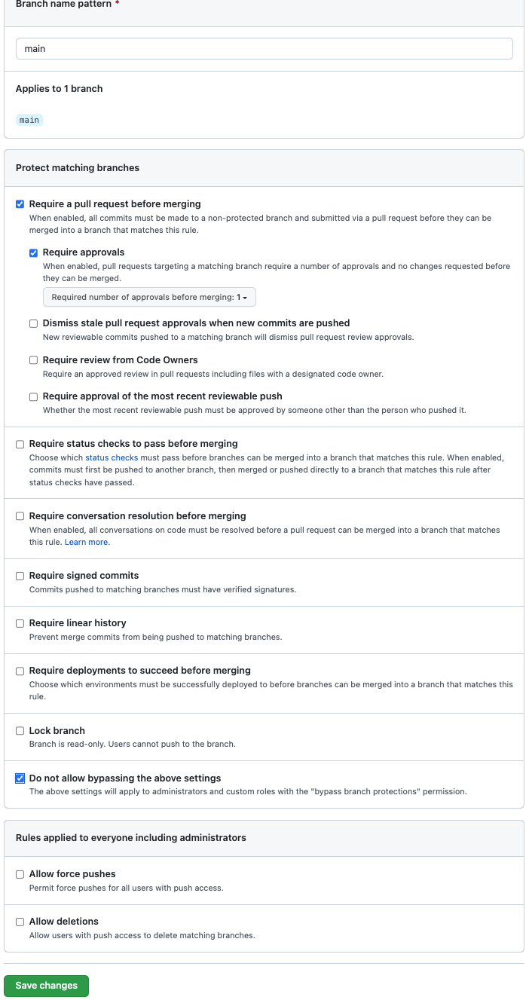

## ABC-scrum-github-activity ##

- One person will need to create a repository and then add their team members as collaborators. While in your repository on github go to "Settings > Collaborators > Add People" and then search for your teammates by name or email. They will be sent an email to join the repo, they will need to open the email and follow the link to become an active member of the repo.

# Copy the necessary files and folders to your project (photos folder, index.html, README.md), then read the entire README before moving on. #

- In this activity your group is tasked to create the ABC's by finding pictures from the web and adding them to the index.html file to display them all. 

- Here is an example of some starter code with the Letter A already done, please update some of the information if you copy and paste it:

```html
<!DOCTYPE html>
<html lang="en">
<head>
    <meta charset="UTF-8">
    <meta http-equiv="X-UA-Compatible" content="IE=edge">
    <meta name="viewport" content="width=device-width, initial-scale=1.0">
    <title>Document</title>
</head>
<body>

    <header>
        <h1>ABC Scrum Activity</h1>
        <h2>Team</h2>
        <ul>
            <li>Robert Anderson</li>
            <li>Steven Castro</li>
            <li>Melissa Averinos</li>
        </ul>
    </header>
    <main>
        <hr>
        <section>
            <h3>Letter A</h3>
            <p>A is for Anchor</p>
            
        </section>
        <hr>
    </main>
</body>
</html>
```

- You will need to add a section for each letter in the alphabet to complete the project. Use the example given above for help.


## Begin this activity by... ##

- Add security to the main branch. Go to "Settings > Branches > Add Rule". In the Add Rule page you will need to type "main" in the "Branch Name Pattern" text box at the top. make sure your settings look like this image, and remember that it is case sensitive... "Main" does not equal "main". After you have everything selected like the image below click the green "Save Changes" button.



- [Publish your page](https://github.com/reanderson89/JFS_NAT_006_Activity_Bank/tree/main/01-git-github-scrum/03-github-pages). Since you do not have any HTML yet your README.md will be displayed on the live page in the meantime.

- Have a scrum meeting!

- [Link to scrum walk-through](https://docs.google.com/document/d/1vmgCw0jRXkeVc6nimG8Qp0-GQ_DNu4Huj05krMAiM6c/edit?usp=sharing")

- Your team should create a project board and then create an issue for EVERY letter. This is repetitive, and is meant to be used as practice.

- Start your first sprint by moving one of the assigned letters to "In progress" for each person. Once everyone is done with their letter, close the issues and then move to the next letters.

- Practice branching in your repository by creating a new branch for every letter that you work on. For example if you personally get tasked with issue "#3 letter C", then create a branch called "3-letterC". Including the issues number on the branch name is helpful looking through old branches if needed. Once you finish that issue and are done with the branch, make sure to create a new branch for your next issue. For example, if you are next tasked with "#6 letter F" your branch would be "6-letterF".

## Useful commands for creating and moving to branches...
    - `git branch` (shows current local branches)
    - `git branch branchName` (creates a new branch)
    - `git checkout branchName` (moves you to the branch listed)
    - `git checkout -b branchName` (creates a new branch and moves you to it)

## How to push a branch... 
    - `git status`
    - `git add .`
    - `git commit -m 'message'`
    - `git status`
    - `git pull origin main`
    - `git push origin branchName`


 


