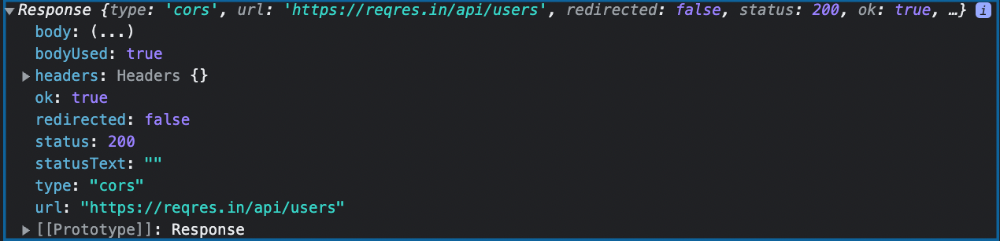

# Using Fetch

* Documentation for fetch(): https://www.w3schools.com/js/js_api_fetch.asp , https://developer.mozilla.org/en-US/docs/Web/API/Fetch_API/Using_Fetch

* In order to send requests to either GET information POST, PUT, or DELETE we can use the Fetch API.

* fetch() is part of the browser and gives us a much simpler way to send and receive data. fetch() is built to return a promise and it works very well with async-await. 

* for this first activity don't worry about using functions or async-await, just make a GET request (the default request method and doesn't need any extra arguments) using fetch() to this url https://reqres.in/api/users and use .then() with a `response` parameter to console.log() the response. You will notice that you get something that looks like this:

* turn the response into JSON (JavScript Object Notation) by doing response.json() and then return it. What is JSON? https://www.w3schools.com/whatis/whatis_json.asp

* chain another .then() method that has `users` as a parameter and then console.log() the users. You should be receiving the response.json() object that is returned from the first .then() method and will now be able to see the actual users

* go to the url for the API that we are using and read documentation on how to access different data. https://reqres.in/